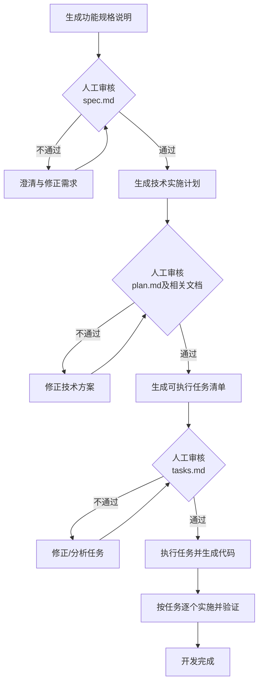

执行流程是一套引导式的标准化工作流，其核心理念是“**代码为规格服务**”，旨在将AI从一个随性的结对编程伙伴，调教成一位靠谱的工程师。

### 🗺️ 核心工作流概览

整个流程就像一条清晰的“流水线”，通过一系列指令，步步为营地将想法变为代码。其核心流程如下：

### 详细步骤解析

下面，我们按阶段一步步拆解这个流程。

#### 1️⃣ 确立宪法：

这是为整个项目确立“宪法”的基石阶段。

*   **目的**：定义项目不可协商的基本原则，如代码规范、架构约束、测试策略等。
*   **作用**：这些原则会在后续所有阶段被 AI 自动引用和遵守，确保生成的所有产物都符合项目统一的基调。
*   **成果**：生成 `constitution.md` 文件，作为项目治理的核心。

#### 2️⃣ 定义“做什么”：

此阶段将自然语言的功能描述转化为结构化的需求文档。

*   **输入**：一个用自然语言描述的功能需求。
*   **过程**：AI 会根据输入，基于内置模板创建一个详细的功能规格说明（`spec.md`），其中包含用户故事、验收标准等。
*   **关键点：人工审核**。此阶段完成后，流程会暂停，等待你来审核 `spec.md`。这是确保 AI 完全理解需求的关键节点。如果审核不通过，可以，针对模糊点进行多轮澄清，直至达成共识。

#### 3️⃣ 规划“怎么做”：

在需求明确后，此阶段将重点转向技术实现。

*   **输入**：前一步确认的 `spec.md`，以及用户提供的技术偏好和约束（如编程语言、框架、数据库等）。
*   **过程**：AI 会深入思考如何将需求落地，并生成一系列技术文档，搭建起从“做什么”到“怎么做”的桥梁。
*   **成果**：会生成一组关键的“驾驶文档”，为后续的任务分解提供蓝图：
    *   **`plan.md`**：核心技术方案文档，包含技术栈选型、项目结构、架构决策等。
    *   **`research.md`**：技术调研文档，记录关键技术选型的决策依据和最佳实践。
    *   **`data-model.md`**：数据模型文档，定义数据库表结构、实体关系等。
    *   **`contracts/`**：接口契约目录，通常包含 API 规范文档。
    *   **`quickstart.md`**：快速上手指南，包含环境搭建和运行项目的步骤。
*   **再次审核**：此阶段同样需要人工审核通过后，才能进入下一步。

#### 4️⃣ 分解“任务清单”：

现在，蓝图已定，需要将其拆解为 AI 可以一步步执行的明确指令。

*   **输入**：前一阶段生成的所有设计文档，如 `plan.md`, `spec.md`, `data-model.md`, `contracts/` 等。
*   **过程**：将所有技术决策转化为一份详细的、有序的任务清单。
*   **成果**：生成 `tasks.md` 文件，它按用户故事组织，包含以下特点：
    *   **按阶段组织**：任务被划分为“项目初始化”、“基础架构”、“用户故事实现”、“完善与优化”等阶段。
    *   **任务足够小**：每个任务都是具体、可执行、可独立验证的工作单元。
    *   **依赖关系明确**：清晰标出任务的先后顺序和依赖关系。
    *   **文件路径明确**：为每个任务指明具体的操作文件。
*   **最终审核**：生成的任务清单需经过最后的审核，确保分解合理、可执行。

#### 5️⃣ 生成“代码”：

这是流程的最后一公里，AI 将根据蓝图和清单，开始“搬砖写代码”。

*   **输入**：完整的项目上下文和经过审核的 `tasks.md`。
*   **过程**：AI 会严格遵循 `tasks.md` 清单，采用“一次只做一件事”的方式，按顺序、有条不紊地逐个实现任务。这种方法能确保 AI 保持专注，生成的代码更精准，也更容易在每一步进行验证。
*   **成果**：可运行的项目代码。

### 💎 总结：

这个流程的核心优势在于将不确定性变为确定性：

*   **将混乱变有序**：告别“Vibe Coding”的反复拉扯，通过清晰的阶段划分，让开发过程变得可控。
*   **人工审核是关键**：在每个关键节点强制进行人工审核，确保 AI 在正确的轨道上工作，防止它“跑偏”。
*   **文档驱动开发**：文档不再是摆设，而是驱动整个开发流程的“源代码”，实现了“代码为规格服务”。
*   **提升AI代码质量**：通过结构化的指导和分步执行，让 AI 生成的代码更精准、更符合预期。