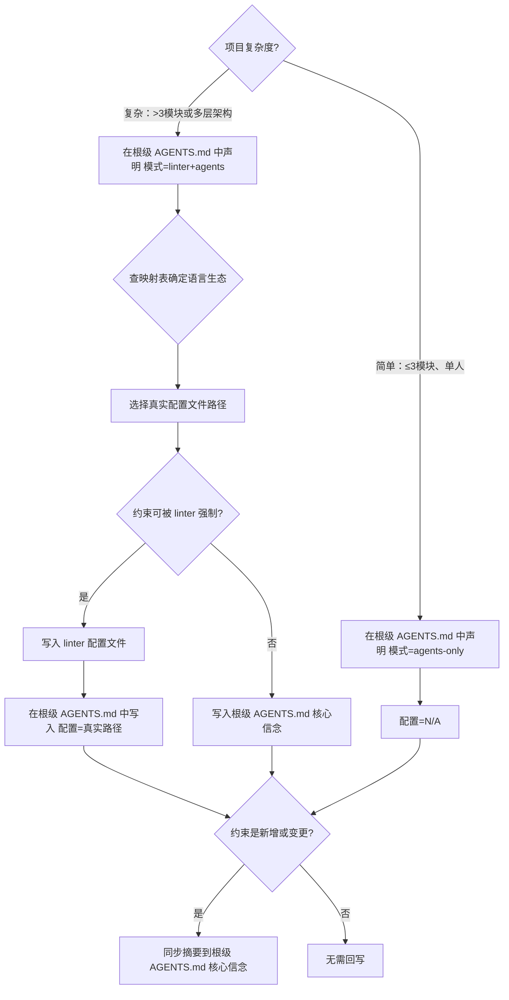

# 架构约束标准

## 目录

- [分层架构](#分层架构)
- [模块设计基线](#模块设计基线)
- [约束写入方式](#约束写入方式)
  - [决策流程](#决策流程)
  - [硬约束配置文件映射表](#硬约束配置文件映射表)
  - [跨代码库协同约束](#跨代码库协同约束)
  - [编译型构建系统约束](#编译型构建系统约束)
  - [可强制 vs 声明式约束](#可强制-vs-声明式约束)
  - [约束机制声明](#约束机制声明)
- [黄金原则](#黄金原则)
- [验证能力](#验证能力)

---

## 分层架构

根据项目类型设定分层：

| 项目类型 | 分层 |
|---------|------|
| Web应用 | UI → Runtime → Service → Repo → Config → Types |
| API服务 | Routes → Service → Repo → Config → Types |
| 命令行 | CLI → Service → Config → Types |
| 命令行（TUI 应用） | EventLoop → View(渲染) → State(状态) → Command(命令) → Service → Config → Types |
| AI应用 | Interface → Agent → Service → Config → Types |
| 单文件/脚本 | 无需分层，在 AGENTS.md 核心信念中声明："保持单文件直到超过 200 行" |
| 桌面应用 | UI(前端SPA) → IPC(桥接层) → Native(原生层) → Worker(子进程/外部服务) → Config → Types |
| Rust 系统级项目（workspace 跨 crate） | Interface → Core(核心库) → Service(服务层) → Infra(基础设施) → Config → Types（跨 crate 依赖方向：外层 crate 只能依赖内层 crate 的公共 API） |

依赖方向只能"向前"（向下），跨层依赖 → 机械禁止。

> 表中为概念分层，未必逐一对应目录。例如 Web 应用的 **Runtime** 指运行时编排层（请求生命周期、状态管理）；简单项目可并入 Service，目录上无需单独建 `runtime/`（参见 `project-structure.md` 的目录建议）。
>
> 桌面应用特殊说明：**UI** 通常是 React/Vue SPA（WebView 内嵌，无 SSR 需求）；**IPC** 是前端与原生层的协议边界（Tauri commands / Electron IPC），必须通过类型化契约（JSON Schema / TypeScript 接口）定义；**Native** 用 Rust/Tauri 处理文件系统、进程管理、系统 API；**Worker** 是可选的子进程/外部服务（如 Python AI Worker），通过 stdio/HTTP 与原生层通信。
>
> TUI 应用特殊说明：**EventLoop** 是主循环，驱动事件分发和渲染调度；**View** 负责终端渲染（布局、ANSI 输出、滚动区域），通常用 ratatui 的 `Widget`/`Layout` trait；**State** 维护应用状态树（会话、缓冲区、光标位置等），禁止 View 直接修改状态，必须通过 **Command** 层提交变更；**Command** 是事件处理器，将按键/鼠标事件翻译为状态变更或服务调用。TUI 性能约束：单次渲染帧 < 16ms（60fps），终端兼容性覆盖 xterm/kitty/warp。
>
> Rust workspace 跨 crate 特殊说明：**Interface** crate（如 `codex-cli`、`codex-tui`）是入口点，只依赖 Core 的公共 API；**Core** crate（如 `codex-core`）是业务核心，不得依赖任何 Interface 层 crate；**Service** crate（如 `codex-exec`、`codex-skills`）提供独立服务，可依赖 Core 但不得互相依赖；**Infra** crate（如 `codex-config`、`codex-protocol`、`codex-secrets`）是底层基础设施，可被所有上层 crate 依赖。**关键约束**：Core crate 不得"膨胀"——新功能应创建新 crate 而非加入 Core（参见 AGENTS.md 的"resist adding code to codex-core"原则）。

## 模块设计基线

划分模块边界、编写 `docs/ARCHITECTURE.md` 和审查模块形状时，使用以下判据：

- **接口小，实现深**：好模块让调用者学的东西少、能做的事多。设计接口先问三句：方法能更少吗？参数能更简单吗？还能把更多复杂度藏进去吗？
- **删除测试**：想象删掉这个模块——复杂度直接消失，说明它只是转发层，删掉；复杂度扩散到所有调用点重新出现，说明它在承担真实工作，保留。
- **接受依赖，不自己创建**：模块需要的协作对象从参数传入，不在内部创建（不在函数体里 `new` 数据库连接、`new` 外部客户端）——这是可测试性的来源。
- **返回结果，不做隐蔽副作用**：计算型函数返回新值，不就地修改传入的对象。

适用于任何粒度：函数、类、文件、目录分层。项目的关键模块如果明显符合"接口小实现深"，可作为架构不变量写入 `docs/ARCHITECTURE.md` 或 AGENTS.md 架构章节。

## 约束写入方式

### 决策流程



**关键原则**：错误信息本身就是代理可读的指导。linter 报错比 AGENTS.md 声明更有效，因为它是机械强制而非建议。

**回写原则**：AGENTS.md 是默认读取入口和关键约束摘要。所有项目级约束源（linter 配置、子文档）的核心摘要必须回写根级 AGENTS.md，确保代理仅读根级 AGENTS.md 即可知道还要读哪些规范。回写时机和动作见 `ai-coding-workflow.md` 的“设计原则”和“文档同步”。

**模式优先原则**：先在根级 AGENTS.md 的 `约束机制` 章节中声明 `模式`，再决定是否需要真实配置文件。脚本不再根据目录结构推断“复杂项目”，而是以显式声明为准。

### 硬约束配置文件映射表

按语言生态（而非框架）分组，与 `tech-stack-recommendations.md` 对齐：

| 语言生态 | 默认配置文件 | 进阶配置文件 | 可强制约束 | 声明式约束（写根级 AGENTS.md） |
|---------|------------|------------|-----------|----------------------|
| **Python** | `ruff.toml`（或 `pyproject.toml` `[tool.ruff]`） | `pyproject.toml` `[tool.importlinter]`（层间依赖方向） | 代码风格、import 排序、未使用导入、行长度、简单模式禁止 | 层间依赖方向（未配 import-linter 时）、架构不变量、技术选型约束 |
| **JS / TS** | `eslint.config.js`（ESLint 9+ flat config） | 同文件 + `eslint-plugin-import`（层间依赖方向） | 代码风格、import 限制、禁止特定 API、no-restricted-imports、层间依赖方向 | 设计原则、技术选型约束 |
| **Vue** | `eslint.config.js`（含 `eslint-plugin-vue`） | 同 JS/TS 进阶 | 同 JS/TS + Vue 特定规则（组件命名、props 类型等） | 同 JS/TS |
| **Svelte** | `eslint.config.js`（含 `eslint-plugin-svelte`） | 同 JS/TS 进阶 | 同 JS/TS + Svelte 特定规则 | 同 JS/TS |
| **Dart** | `analysis_options.yaml` | — | lint 规则、类型检查严格度 | 架构不变量、层间依赖方向 |
| **Rust** | `rustfmt.toml` + `clippy.toml` | `cargo audit`（安全审计）+ `cargo llvm-lines`（依赖方向）+ `bazel test`（Bazel 项目） | 代码风格（rustfmt）、lint 规则（clippy）、未使用导入、类型安全、`cargo check` 编译检查 | 架构不变量、FFI 边界约束、内存安全约定、IPC 契约完整性、Cargo workspace 跨 crate 依赖方向（Core 不得依赖 Interface） |

**使用方法**：

1. 先决定根级 `约束机制.模式`
2. `agents-only`：配置写 `N/A`，所有约束直接写根级 AGENTS.md
3. `linter+agents`：在映射表中找到对应语言生态，选择真实配置文件路径，并写回根级 AGENTS.md
4. 需要层间依赖方向强制时，启用“进阶配置文件”
5. 不可被 linter 强制的约束，始终写入根级 AGENTS.md 核心信念

### 跨代码库协同约束

当项目由多个独立代码库协同组成时（如桌面应用 = 前端 SPA + 原生层 + Worker + 服务端），必须遵守以下约束：

| 约束项 | 说明 | 强制方式 |
|-------|------|---------|
| **IPC 契约先行** | 跨进程/跨语言通信必须通过类型化契约（JSON Schema / `.d.ts` 接口 / Protobuf）定义，契约变更需版本号 | 声明式（AGENTS.md 核心信念）+ 契约文件走独立 review |
| **单向依赖** | 前端只依赖 IPC 契约，不直接 import 原生层或 Worker 代码；Worker 只依赖契约，不反向依赖 UI | linter 禁止跨代码库 import（`no-restricted-imports`）+ 声明式约束 |
| **协议可回放** | 所有 IPC 消息必须可序列化/反序列化，禁止传递闭包、Generator、不可序列化对象 | 声明式约束 + 集成测试验证序列化/反序列化 |
| **跨代码库边界** | 明确每个代码库的职责边界（如 `app/` 负责 UI，`app/src-tauri/` 负责原生，`worker/` 负责 AI 处理，`server/` 负责账号/额度），禁止跨边界 import | 声明式约束 + 代码审查门禁 |
| **契约同步** | 契约变更时，所有消费方必须同步更新，CI 中需有契约一致性检查 | CI 脚本 + 集成测试 |

> **典型场景**：Tauri 应用的前端（TS）通过 `invoke('command_name', payload)` 调用 Rust 原生层命令，命令的输入输出类型定义在共享的 `.d.ts` 文件或 `contracts/` JSON 文件中，前后端各自实现但共享类型契约。

### 编译型构建系统约束

使用 Bazel、Cargo workspace、Gradle 等编译型构建系统的项目，除通用约束外，还需遵守以下规则：

| 约束项 | 说明 | 强制方式 |
|-------|------|---------|
| **构建系统主从关系** | 明确主构建系统（如 Bazel 为生产构建，Cargo 为开发调试），主系统的 BUILD 文件必须与源文件同步 | 声明式约束（AGENTS.md 核心信念）+ CI 检查主系统构建是否通过 |
| **依赖声明一致性** | 同一依赖在主从构建系统中版本必须一致（如 Bazel MODULE.bazel.lock 与 Cargo.lock 同步） | CI 脚本（`bazel-lock-update`）+ lockfile 差异检测 |
| **跨 crate 可见性** | Rust `pub mod` 控制 crate 间可见性；禁止 `pub use` 内部实现细节作为公共 API | `clippy::restricted_public_levels` + 代码审查 |
| **Core crate 膨胀防治** | 禁止向 Core crate 添加非核心功能，新功能必须创建独立 crate | 声明式约束 + PR review 门禁 |
| **编译检查前置** | 任何 Rust 代码变更必须先通过 `cargo check`（或 `bazel build` 对应 target） | CI 强制 + `pre-commit` hook |
| **BUILD 文件同步** | 新增源文件/依赖时，必须同步更新 Bazel BUILD 文件（compile_data/build_script_data/test 目标） | 声明式约束 + CI 检查 Bazel 构建 |
| **Feature flag 约束** | `Cargo.toml` 的 `[features]` 必须文档化，禁止隐式 feature 激活 | 声明式约束 + `cargo tree --features` 检查 |

> **典型场景**：Codex 项目用 Bazel 作为主构建系统（生产/CI），Cargo 作为开发调试工具。开发者修改 Rust 代码后运行 `cargo check` 快速验证，提交前运行 `just fix`（含 `rustfmt` + `clippy`）和 `just test` 验证。CI 中运行 `bazel test` 全量测试确保 BUILD 文件与源码同步。

### 可强制 vs 声明式约束

| 约束类型 | 判断标准 | 写入位置 | 示例 |
|---------|---------|---------|------|
| **可强制约束** | linter 规则能直接检测并报错 | linter 配置文件 | `no-console`、`unused-imports`、`import/no-restricted-paths` |
| **声明式约束** | 需要人类判断，linter 无法机械检测 | 根级 AGENTS.md 核心信念 | “数据层不依赖展示层”、“优先使用共享工具包” |

Python 特殊说明：Ruff 不支持 import 路径限制（如"service 层不能导入 ui 层"）。如需强制层间依赖方向，需额外配置 `import-linter`（在 `pyproject.toml` `[tool.importlinter]` 中声明契约）。未配 import-linter 时，层间依赖方向只能作为声明式约束写入根级 AGENTS.md。

Rust 特殊说明：`cargo` 没有内建的层间依赖方向强制工具。`cargo llvm-lines` 可检查函数调用关系但不直接支持模块边界。桌面项目的 Rust 层间依赖方向（如 `worker_runtime` 不得依赖 `ui_preferences`）通常通过 `pub mod` 可见性控制 + 代码审查门禁实现，同时作为声明式约束写入 AGENTS.md。Rust workspace 跨 crate 依赖方向（如 Core 不得依赖 Interface）需同时参考「编译型构建系统约束」章节。

多代码库配置示例：当项目包含多个代码库（如 `app/` + `worker/` + `server/`），根级 `约束机制.配置` 应列出各代码库的主 linter：

```markdown
- 模式：`linter+agents`
- 配置：`eslint.config.js`（前端）, `ruff.toml`（Worker）, `rustfmt.toml`（Rust 原生层）
```

Rust workspace 配置示例（如 Codex 项目）：

```markdown
- 模式：`linter+agents`
- 配置：`rustfmt.toml`（全 workspace）, `clippy.toml`（全 workspace）, `deny.toml`（依赖审计）
```

### 约束机制声明

在根级 AGENTS.md 中固定保留以下机器可读章节：

```markdown
## 约束机制

- 模式：`agents-only` 或 `linter+agents`
- 配置：`N/A` 或真实配置文件路径
```

规则：

1. `agents-only`：配置必须写 `N/A`
2. `linter+agents`：配置必须写真实文件路径，如 `ruff.toml`
3. CLI/单文件项目默认使用 `agents-only`
4. 简单多文件项目默认使用 `agents-only`
5. 复杂项目使用 `linter+agents`
6. 多代码库协同项目（桌面应用、前后端分离）默认使用 `linter+agents`，配置列各代码库的主要 linter 路径

这一章节的作用：
1. 代理执行时无需猜测约束如何落地
2. 验证脚本可直接读取根级模式并决定是否要求真实配置文件
3. CLI 判断仅用于架构文档替代，不再用于推断复杂度

## 黄金原则

写入 AGENTS.md 核心信念中的架构准则：

| 原则 | 理由 |
|------|------|
| 共享工具包优于手写 helper | 不变量集中，避免重复 |
| 边界验证优于 YOLO 猜测 | 代理不能猜测数据形状 |
| "无聊"技术优于新奇技术 | 训练集覆盖、API 稳定 |
| 自实现优于 opaque 库 | 代理能理解、修改、测试 |
| 本地优先优于云端 | 桌面应用默认本地处理，离线可用，隐私可控 |
| Core crate 不膨胀 | 新功能创建独立 crate 而非加入 Core，防止核心库成为"垃圾桶" |

## 验证能力

代理自治的前提是能自己验证工作，不依赖人类 QA。按项目复杂度，配置以下验证手段：

| 验证类型 | 适用项目 | 验证方式 | 示例 |
|---------|---------|---------|------|
| **端点验证** | Web/API | `curl` 或 HTTP 客户端访问 | `curl localhost:5000/health` 返回 200 |
| **页面验证** | Web 应用 | 浏览器访问确认渲染 | 浏览器打开 `localhost:3000` 看到 Hello World |
| **输出验证** | 命令行/脚本 | 运行并检查 stdout | `python main.py` 输出预期结果 |
| **测试验证** | 所有项目（推荐） | 运行自动化测试 | `pytest` 全部通过 |
| **类型验证** | 有类型系统的项目 | 静态类型检查 | `mypy src/` 或 `tsc --noEmit` 无错误 |
| **编译验证** | Rust/C++/Go 等编译型项目 | 编译通过检查 | `cargo check` 无错误 / `bazel build //...` 全量通过 |
| **格式化验证** | 所有项目 | 格式化工具检查 | `cargo fmt --check` / `ruff check` / `prettier --check` |
| **TUI 渲染验证** | TUI 应用 | 终端渲染快照对比 | 启动应用 → 截取 ANSI 输出快照 → 与预期快照 diff 无差异 |
| **桌面构建验证** | 桌面应用 | 完整打包 + 安装包测试 | `npm run tauri build` 成功产出安装包，安装后可正常启动 |
| **进程生命周期验证** | 桌面应用（含子进程 Worker） | 启动/停止/崩溃恢复测试 | 启动 Worker → 正常运行 → 强制杀进程 → 验证 Watchdog 恢复 |
| **IPC 契约验证** | 跨代码库项目 | 端到端序列化/反序列化测试 | 发送完整 IPC 消息 → 验证原生层正确接收并返回 → 前端正确解析 |
| **平台签名验证** | 需要分发的桌面应用 | 平台签名/公证检查 | macOS: `codesign --verify` + `spctl --assess`；Windows: signtool verify |

原则：**每个 ExecPlan 的 Validation 章节必须包含至少一种可执行的验证方式**。验证命令必须具体到可直接复制运行，不要写“手动检查”这种模糊描述。
