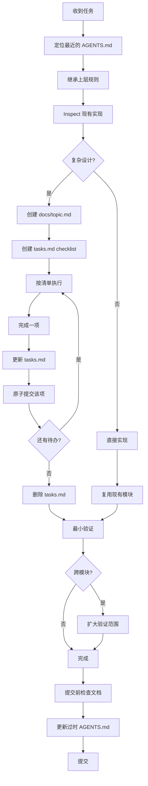

# AI Coding 执行流程

## 目录

- [设计原则](#设计原则)
- [执行流程](#执行流程)
- [关键步骤详解](#关键步骤详解)
- [验证策略](#验证策略)

---

## 设计原则

### 单一来源

`AGENTS.md` 是唯一指令源。其他文件（CLAUDE.md、Cursor规则、Copilot指令）只是引用或镜像。

**约束优先级链**：

当多个约束源之间存在冲突时，按以下优先级解决：

```
AGENTS.md 核心信念 > linter 硬约束配置 > 子文档详细规范
```

- AGENTS.md 核心信念是最高优先级，子文档（DESIGN.md / SECURITY.md / core-beliefs.md）约束不得与之矛盾
- linter 硬约束是机械强制的，优先级仅次于 AGENTS.md（因为 linter 规则本身需先在 AGENTS.md 中声明路径）
- 子文档是 AGENTS.md 的详细展开，可以更具体，但不能更宽松或相反

**回写触发条件**：

以下情况必须检查并回写 AGENTS.md：

1. **新增子文档时** — 将核心约束摘要写入 AGENTS.md 核心信念（如新增 SECURITY.md 时，将"API Key 不得硬编码"写入 AGENTS.md）
2. **子文档约束变更时** — 同步更新 AGENTS.md 中的对应摘要
3. **发现子文档与 AGENTS.md 矛盾时** — 以 AGENTS.md 为准修正子文档；如确需放宽，先改 AGENTS.md 再改子文档

**应用**：
- 新建项目时，AGENTS.md 放核心规则
- 不要在多个文件重复相同规则
- 框架特定规则可放子目录 AGENTS.md

**禁止**：
- 在 CLAUDE.md 中定义与 AGENTS.md 冲突的规则
- 在多处重复维护同一规则
- 子文档中出现与 AGENTS.md 核心信念矛盾的约束

### 层次继承

从最近的 AGENTS.md 开始，向上继承未覆盖的规则。

**继承链**：

```
模块级 AGENTS.md → 子系统级 AGENTS.md → 根级 AGENTS.md
```

**应用**：
- 模块级规则只写该模块特有内容
- 共享规则放上层，避免重复
- 本地文件覆盖上层，不冲突时继承

### 避免重复

共享规则放上层，本地规则只添加不重复。

**判断标准**：
- 规则适用于 ≥2 个模块 → 放上层
- 规则只适用于当前模块 → 放本级

### 自动标注

生成的文档带注释，提醒编辑源头而非产物。

**标注格式**：

```markdown
<!-- 由 vibe-coding-launcher 生成。如需修改，编辑项目元数据。 -->
```

---

## 执行流程

### 日常开发流程

```
收到任务 → 定位 AGENTS.md → 继承规则 → Inspect → 设计判断 → 执行追踪 → 原子提交 → 渐进验证 → 文档同步 → 提交
```

### 流程图



---

## 关键步骤详解

### 1. 定位最近的 AGENTS.md

从当前工作目录向上查找最近的 AGENTS.md，先读它，再向上继承。

**查找顺序**：

```
当前目录 → 父目录 → ... → 项目根目录
```

### 2. Inspect 现有实现

修改代码前必须：

| 检查项 | 说明 |
|--------|------|
| 当前实现 | 读取要修改的代码 |
| 相邻调用点 | 找谁调用了这段代码 |
| 最近测试 | 找相关测试文件 |
| 相关文档 | 找 AGENTS.md、ARCHITECTURE.md |

**禁止**：基于假设直接修改代码。

**必须**：先 inspect，理解现状再动手。

### 3. 设计判断

在实现前，判断变更范围决定工作流程：

| 判断条件 | 定义 | 行动 |
|---------|------|------|
| **跨模块变更** | 修改 ≥2 个不同目录下的文件，或新增/修改共享接口、共享类型 | 创建 docs/topic.md + tasks.md checklist |
| **新架构决策** | 添加新层级、新依赖方向、新抽象层、持久化层变更 | 创建 docs/topic.md，明确决策理由 |
| **单模块小改动** | 只修改单个目录内的文件，不触及共享接口/类型 | 直接实现 |

**判断方法**：

1. 列出所有将被修改/新增的文件
2. 按目录分组统计
3. 检查是否有共享类型文件（如 `types.ts`、`models.py`）被修改
4. 检查是否有共享接口（如 API endpoint、公共函数签名）被修改
5. 根据上述标准选择工作流程

**示例判断**：

| 修改文件 | 目录数 | 共享接口 | 判断 | 流程 |
|---------|--------|---------|------|------|
| `src/api/user.py` | 1 | 无 | 单模块 | 直接实现 |
| `src/api/user.py`, `src/api/auth.py` | 2 | 无 | 跨模块 | docs/topic.md + checklist |
| `src/api/user.py`, `src/types/user.ts` | 2 | 有（类型） | 跨模块 | docs/topic.md + checklist |
| `src/api/models.py`（新增表） | 1 | 有（持久化） | 新架构决策 | docs/topic.md |

### 4. 执行追踪

tasks.md 作为可见执行状态：

**格式要求**：
- 使用 `- [ ]` 和 `- [x]`
- 每项带验证条件 `✅`
- 一项一勾选

**示例**：

```markdown
- [ ] 添加用户认证 ✅ `curl /auth` 返回 401
- [x] 创建用户表 ✅ `python -c "from models import User"` 不报错
```

### 5. 原子提交

每完成一项 checklist → 更新 tasks.md → 立即提交。

**原则**：
- 一项一提交，可追溯可回滚
- 提交信息说明完成的项

**禁止**：
- 批量提交多个完成项
- 部分完成就提交

### 6. 渐进验证

从最小验证开始：

```
单模块测试 → 跨模块测试 → 全量测试
```

**原则**：先跑最小，成功再扩大。

**时机**：
| 变更类型 | 最小验证 | 扩大验证 |
|---------|---------|---------|
| 单模块代码 | 该模块测试 | - |
| 跨模块接口 | 两模块测试 | 集成测试 |
| 共享DTO/类型 | 所有消费者类型检查 | 全量测试 |

### 7. 文档同步

提交前检查：

| 检查项 | 行动 |
|--------|------|
| AGENTS.md 是否需要更新？ | 新规则写入、过时规则删除 |
| 新规则是否需要写入？ | 添加到 Do 或 Avoid |
| 过时规则是否需要删除？ | 移除不再适用的规则 |

---

## 验证策略

### 验证层次

| 层次 | 命令示例 | 适用时机 |
|------|----------|---------|
| 最小 | 单模块测试/单文件lint | 每次修改 |
| 扩大 | 跨模块测试/子系统集成 | 跨模块变更 |
| 全量 | 全测试套件/pre-commit | 提交前 |

### 验证命令标准格式

```
{目录} {命令} - 验证{范围}
```

**示例**：
- `src/api pytest -q` - 验证后端
- `src/web npm run type-check` - 验证前端类型
- `pre-commit run -a` - 全量质量门禁

### 何时跳过验证

只有以下情况可跳过：
- 仅修改文档/注释
- 无运行代码变更
- 必须在任务摘要中记录原因

---

## 与 ExecPlan 的关系

| 维度 | 本流程 | ExecPlan |
|------|--------|----------|
| 适用 | 日常开发、小改动 | 功能级开发、多步骤任务 |
| 粒度 | 单项任务 | 完整功能 |
| 文档 | tasks.md checklist | docs/exec-plans/*.md |

**选择标准**：
- 能在 30 分钟内完成 → 用本流程 + tasks.md
- 需要数小时到数天 → 用 ExecPlan + tasks.md