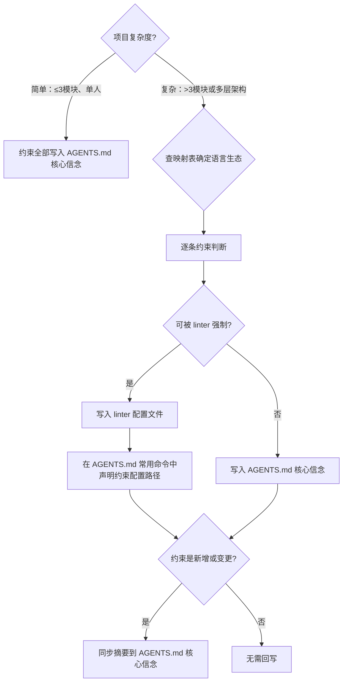

# 架构约束标准

## 目录

- [分层架构](#分层架构)
- [约束写入方式](#约束写入方式)
  - [决策流程](#决策流程)
  - [硬约束配置文件映射表](#硬约束配置文件映射表)
  - [可强制 vs 声明式约束](#可强制-vs-声明式约束)
  - [约束配置路径声明](#约束配置路径声明)
- [黄金原则](#黄金原则)
- [验证能力](#验证能力)

---

## 分层架构

根据项目类型设定分层：

| 项目类型 | 分层 |
|---------|------|
| Web应用 | UI → Runtime → Service → Repo → Config → Types |
| API服务 | Routes → Service → Repo → Config → Types |
| 命令行 | CLI → Service → Config → Types |
| AI应用 | Interface → Agent → Service → Config → Types |
| 单文件/脚本 | 无需分层，在 AGENTS.md 核心信念中声明："保持单文件直到超过 200 行" |

依赖方向只能"向前"（向下），跨层依赖 → 机械禁止。

## 约束写入方式

### 决策流程



**关键原则**：错误信息本身就是代理可读的指导。linter 报错比 AGENTS.md 声明更有效，因为它是机械强制而非建议。

**回写原则**：AGENTS.md 是唯一指令源。所有约束源（linter 配置、子文档）的核心摘要必须回写 AGENTS.md，确保代理仅读 AGENTS.md 即可知晓项目关键约束。具体触发条件见 `references/ai-coding-workflow.md` 的"回写触发条件"。

### 硬约束配置文件映射表

按语言生态（而非框架）分组，与 `tech-stack-recommendations.md` 对齐：

| 语言生态 | 默认配置文件 | 进阶配置文件 | 可强制约束 | 声明式约束（写 AGENTS.md） |
|---------|------------|------------|-----------|----------------------|
| **Python** | `ruff.toml`（或 `pyproject.toml` `[tool.ruff]`） | `pyproject.toml` `[tool.importlinter]`（层间依赖方向） | 代码风格、import 排序、未使用导入、行长度、简单模式禁止 | 层间依赖方向（未配 import-linter 时）、架构不变量、技术选型约束 |
| **JS / TS** | `eslint.config.js`（ESLint 9+ flat config） | 同文件 + `eslint-plugin-import`（层间依赖方向） | 代码风格、import 限制、禁止特定 API、no-restricted-imports、层间依赖方向 | 设计原则、技术选型约束 |
| **Vue** | `eslint.config.js`（含 `eslint-plugin-vue`） | 同 JS/TS 进阶 | 同 JS/TS + Vue 特定规则（组件命名、props 类型等） | 同 JS/TS |
| **Svelte** | `eslint.config.js`（含 `eslint-plugin-svelte`） | 同 JS/TS 进阶 | 同 JS/TS + Svelte 特定规则 | 同 JS/TS |
| **Dart** | `analysis_options.yaml` | — | lint 规则、类型检查严格度 | 架构不变量、层间依赖方向 |

**使用方法**：

1. 根据第二阶段确认的技术栈，在映射表中找到对应语言生态
2. 优先使用"默认配置文件"——覆盖 80% 场景，无需额外依赖
3. 需要层间依赖方向强制时，启用"进阶配置文件"
4. 不可被 linter 强制的约束，始终写入 AGENTS.md 核心信念

### 可强制 vs 声明式约束

| 约束类型 | 判断标准 | 写入位置 | 示例 |
|---------|---------|---------|------|
| **可强制约束** | linter 规则能直接检测并报错 | linter 配置文件 | `no-console`、`unused-imports`、`import/no-restricted-paths` |
| **声明式约束** | 需要人类判断，linter 无法机械检测 | AGENTS.md 核心信念 | "数据层不依赖展示层"、"优先使用共享工具包" |

Python 特殊说明：Ruff 不支持 import 路径限制（如"service 层不能导入 ui 层"）。如需强制层间依赖方向，需额外配置 `import-linter`（在 `pyproject.toml` `[tool.importlinter]` 中声明契约）。未配 import-linter 时，层间依赖方向只能作为声明式约束写入 AGENTS.md。

### 约束配置路径声明

在 AGENTS.md 的"常用命令"章节中，添加约束配置文件路径，供代理和验证脚本定位：

```markdown
## 常用命令

- 约束配置：`ruff.toml`（或 `eslint.config.js` 等，按映射表选择）
- `ruff check .` — 检查代码风格
- ...
```

这一行声明的作用：
1. 代理执行时无需猜测约束写在哪里
2. 验证脚本可检测声明的配置文件是否实际存在
3. 新代理加入项目时，一行即可定位约束机制

## 黄金原则

写入 AGENTS.md 核心信念中的架构准则：

| 原则 | 理由 |
|------|------|
| 共享工具包优于手写 helper | 不变量集中，避免重复 |
| 边界验证优于 YOLO 猜测 | 代理不能猜测数据形状 |
| "无聊"技术优于新奇技术 | 训练集覆盖、API 稳定 |
| 自实现优于 opaque 库 | 代理能理解、修改、测试 |

## 验证能力

代理自治的前提是能自己验证工作，不依赖人类 QA。按项目复杂度，配置以下验证手段：

| 验证类型 | 适用项目 | 验证方式 | 示例 |
|---------|---------|---------|------|
| **端点验证** | Web/API | `curl` 或 HTTP 客户端访问 | `curl localhost:5000/health` 返回 200 |
| **页面验证** | Web 应用 | 浏览器访问确认渲染 | 浏览器打开 `localhost:3000` 看到 Hello World |
| **输出验证** | 命令行/脚本 | 运行并检查 stdout | `python main.py` 输出预期结果 |
| **测试验证** | 所有项目（推荐） | 运行自动化测试 | `pytest` 全部通过 |
| **类型验证** | 有类型系统的项目 | 静态类型检查 | `mypy src/` 或 `tsc --noEmit` 无错误 |

原则：**每个 ExecPlan 的 Validation 章节必须包含至少一种可执行的验证方式**。验证命令必须具体到可直接复制运行，不要写"手动检查"这种模糊描述。
